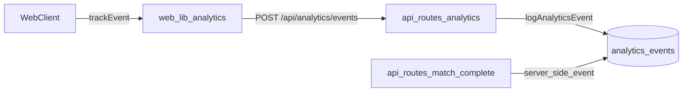

# Analytics Go-Live Decision Doc

## Purpose

This document is the source of truth for analytics decisions taken for go-live.
It is written for:

- Owners who need to understand what is live, why, and the launch checklist.
- AI agents that need reliable implementation intent before making follow-up changes.

## Current Uncommitted Analytics Scope

### 1) Data model and storage

- Added analytics table migration: `packages/db/migrations/0008_analytics_events.sql`.
- Registered migration in `packages/db/migrations/meta/_journal.json`.
- Added Drizzle schema + indexes in `packages/db/src/schema/index.ts`:
  - Table: `analytics_events`
  - Fields: `id`, `event_name`, `user_id`, `save_id`, `payload`, `created_at`
  - Indexes for user, save, and event/time lookup

### 2) API analytics ingestion + server logging

- Added shared insert helper in `apps/api/src/lib/analytics.ts`.
- Added ingestion endpoint in `apps/api/src/routes/analytics.ts`:
  - Route: `POST /api/analytics/events`
  - Requires authenticated session
  - Currently validates `eventName: 'login_successful' | 'login_unsuccessful'`
- Wired analytics route in `apps/api/src/index.ts`.
- Added server-side analytics logging in `apps/api/src/routes/match.ts`:
  - Logs `match_completed` when a player fixture is completed.

### 3) Frontend analytics integration

- Added client helper in `apps/web/src/lib/analytics.ts`:
  - `initAnalytics()` is intentionally a no-op (in-house pipeline, no SDK).
  - `trackEvent()` posts to `/api/analytics/events` as best-effort.
  - `CLIENT_CAPTURED_EVENTS` currently allows `login_successful` and `login_unsuccessful`.
- Bootstrapped analytics in `apps/web/src/main.tsx` via `initAnalytics()`.
- Added page instrumentation calls in:
  - `apps/web/src/components/ProtectedRoute.tsx` (`session_start`)
  - `apps/web/src/pages/LoginPage.tsx` (`sign_in_success`)
  - `apps/web/src/pages/RegisterPage.tsx` (`sign_up_success`)
  - `apps/web/src/pages/NewGamePage.tsx` (`game_created`)
  - `apps/web/src/pages/GamePage.tsx` (`match_started`)
  - `apps/web/src/pages/MatchPage.tsx` (`match_completed`)
  - `apps/web/src/pages/SeasonSummaryPage.tsx` (`season_completed`)
  - `apps/web/src/pages/HomePage.tsx` (`game_over`)

### 4) Go-live infra and abuse protection

- Added in-memory rate limit middleware in `apps/api/src/lib/rate-limit.ts`.
- Enabled rate limits in `apps/api/src/index.ts` for:
  - `/api/auth/*`
  - write-heavy routes (`/api/save*`, `/api/match*`, `/api/transfer*`, `/api/season*`)
  - `/api/analytics/*`
- Added env-driven CORS/base URL controls in `apps/api/src/lib/auth.ts`.
- Added worker vars in `apps/api/wrangler.toml`:
  - `API_BASE_URL`
  - `ALLOWED_ORIGINS`
- Added Pages var in `apps/web/wrangler.toml`:
  - `API_ORIGIN`
- Updated proxy behavior in `apps/web/functions/api/[[path]].ts` (first-party cookie forwarding remains central).

### 5) Legal/discoverability support for analytics launch

- Added public pages and routes:
  - `apps/web/src/pages/PrivacyPage.tsx`
  - `apps/web/src/pages/TermsPage.tsx`
  - `apps/web/src/pages/ContactPage.tsx`
  - Route wiring in `apps/web/src/App.tsx`
- Added footer links to legal/contact from key auth/home screens.
- Updated crawl/discovery assets:
  - `apps/web/public/robots.txt`
  - `apps/web/public/sitemap.xml`

## Go-Live Decisions (Authoritative)

1. Use an in-house analytics table in D1 (`analytics_events`) instead of third-party event SDKs.
2. Keep client analytics non-blocking: event send failures never break gameplay/auth flows.
3. Gate client ingestion narrowly at launch:
   - API route accepts only `login_successful` and `login_unsuccessful` from client payloads.
   - Other `trackEvent()` calls are present in UI code but not sent yet by design.
4. Capture `match_completed` on the server-side in API, independent of client behavior.
5. Require authenticated session for analytics writes; no anonymous event ingestion at go-live.
6. Protect analytics and write endpoints with rate limiting before launch traffic.
7. Keep privacy/terms/contact publicly reachable and indexed as part of launch readiness.

## Enabled Now vs Deferred

### Enabled now

- Storage of analytics events in D1.
- Client -> API analytics path for `login_successful` and `login_unsuccessful`.
- API-side logging for `match_completed`.
- Rate limiting on analytics and write-heavy routes.

### Deferred (intentional)

- Ingesting all client event names currently instrumented in UI.
- Analytics dashboards/reporting queries and retention policies.
- Anonymous analytics collection.
- Cross-worker/distributed rate limiting (current limiter is in-process memory only).

## Event Catalog (Current Implementation)

| Event name         | Producer location | Transport | Persisted now |
|--------------------|-------------------|-----------|---------------|
| `login_successful` | Client via `apps/web/src/lib/analytics.ts` | `POST /api/analytics/events` | Yes |
| `login_unsuccessful` | Client via `apps/web/src/pages/LoginPage.tsx` -> `apps/web/src/lib/analytics.ts` | `POST /api/analytics/events` | Yes |
| `match_completed`  | API via `apps/api/src/routes/match.ts` | Direct DB insert helper | Yes |
| `session_start`    | Client instrumentation only | Not sent at go-live | No |
| `sign_up_success`  | Client instrumentation only | Not sent at go-live | No |
| `sign_in_success`  | Client instrumentation only | Not sent at go-live | No |
| `game_created`     | Client instrumentation only | Not sent at go-live | No |
| `match_started`    | Client instrumentation only | Not sent at go-live | No |
| `season_completed` | Client instrumentation only | Not sent at go-live | No |
| `game_over`        | Client instrumentation only | Not sent at go-live | No |

## Data Flow



## Operational Checklist for Go-Live

### Database

- Apply new D1 migration containing `analytics_events`.
- Verify table and indexes exist in production.

### Environment and routing

- Confirm API worker vars:
  - `API_BASE_URL`
  - `ALLOWED_ORIGINS`
- Confirm web pages var:
  - `API_ORIGIN`
- Confirm `/api/analytics/events` is reachable through Pages proxy path.

### Functional smoke tests

- Authenticate and confirm `login_successful` row is inserted.
- Complete one match and confirm `match_completed` row is inserted.
- Confirm analytics failures do not break login/match flow UX.
- Verify rate limit returns `429` with `Retry-After` under abuse bursts.

## Quick DB Query (Event Overview)

Use this query to get a simple overview of total occurrences per event:

```sql
SELECT
  event_name,
  COUNT(*) AS total_occurrences
FROM analytics_events
GROUP BY event_name
ORDER BY total_occurrences DESC;
```

## Known Risks and Follow-Ups

- Current rate limit is memory-local per worker instance; not globally consistent.
- Client event naming is ahead of ingestion schema; if broader ingestion is needed, update:
  - `apps/web/src/lib/analytics.ts` `CLIENT_CAPTURED_EVENTS`
  - `apps/api/src/routes/analytics.ts` validation schema
  - `apps/api/src/lib/analytics.ts` allowed event names
- No documented retention/deletion policy yet for `analytics_events`.

